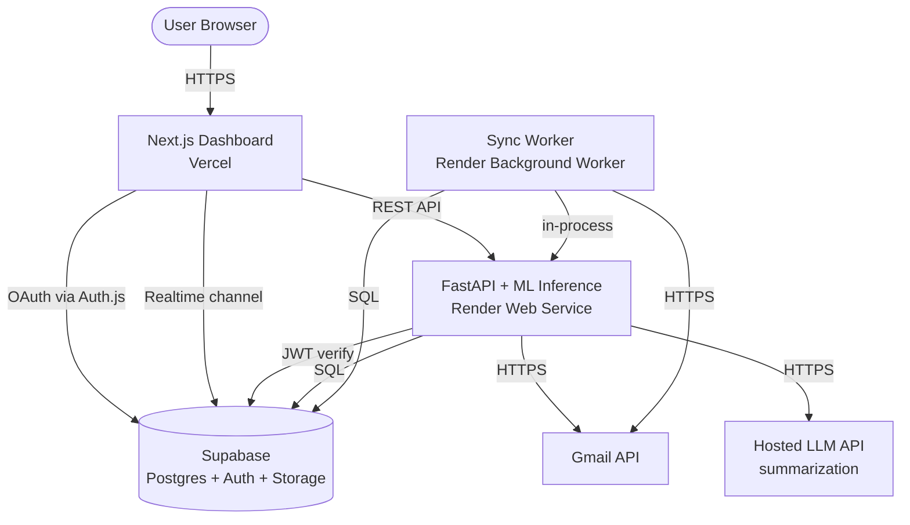

# ARCHITECTURE.md

> System architecture for PriorMail. This file is the canonical reference for how components fit together. If a sibling repo's behavior conflicts with what's described here, this file is correct and the repo needs to change.

---

## 1. System Overview

PriorMail is a 3-tier web app: Next.js client → FastAPI server → Postgres database, with Gmail as the external source and IndoBERT models running in-process on the FastAPI side.



---

## 2. Components

### Next.js Dashboard (Vercel)
- **Repo:** `prior-mail-frontend`
- **Responsibility:** User-facing dashboard, OAuth initiation, viewing emails and tasks
- **Runtime:** Edge + Node (Next.js App Router on Vercel)
- **Outbound:** REST calls to FastAPI, Realtime subscription to Supabase

### FastAPI API (Render Web Service)
- **Repo:** `prior-mail-backend`
- **Responsibility:** REST API, in-process ML inference, LangGraph orchestration
- **Runtime:** Python 3.11, Uvicorn, single instance (MVP)
- **Outbound:** Supabase (SQL + Storage), Gmail API, hosted LLM API (for summarization)
- **Models loaded at startup:** priority classifier, phishing detector

### Sync Worker (Render Background Worker)
- **Repo:** `prior-mail-backend` (same codebase, different entry point)
- **Responsibility:** Periodic Gmail sync per user via `historyId` delta
- **Runtime:** Python 3.11 long-running process with internal scheduler
- **Frequency:** Every 5 minutes per active user (configurable)

### Supabase
- **Postgres:** primary application database
- **Auth:** user identity (Google OAuth via Auth.js)
- **Storage:** model checkpoints (consumed by FastAPI at startup), avatars
- **Vault:** encrypted Gmail OAuth refresh tokens
- **Realtime:** push updates to dashboard on new emails / classifications

### Gmail API
- **Scope:** `gmail.readonly` only
- **Auth:** OAuth 2.0, refresh-token flow
- **Quota:** 1 billion units/day project default; per-user rate limit ~250 units/sec

### Hosted LLM API (TBD)
- **Decision pending:** Anthropic vs OpenAI vs self-hosted (see Open Decisions)
- **Used for:** summarization + task extraction (NOT for priority classification or phishing detection — those use our IndoBERT models)

---

## 3. Data Flow Scenarios

### 3.1 User OAuth Connect

```
User → Vercel: clicks "Connect Gmail"
Vercel → Google: redirect for OAuth (scope: gmail.readonly)
Google → Vercel: redirect with auth code
Vercel → Auth.js callback: exchange code for tokens
Auth.js → Supabase: store/update user, store encrypted refresh_token
Vercel → User: redirect to dashboard
```

### 3.2 Initial Inbox Sync (first connect)

```
Vercel → FastAPI: POST /api/v1/sync (user JWT)
FastAPI → Supabase: get user's refresh_token (decrypt via Vault)
FastAPI → Gmail: list messages (limit: 200 most recent)
FastAPI → Gmail: batch fetch message bodies
FastAPI → LangGraph pipeline (see 3.4)
FastAPI → Supabase: persist emails with classification results
FastAPI → Supabase: update user.last_sync_history_id
FastAPI → Vercel: return job summary
Supabase Realtime → Vercel: push notifications for each persisted email
```

### 3.3 Incremental Sync (background worker)

```
Loop every 5 min per user:
  Worker → Supabase: get user.last_sync_history_id
  Worker → Gmail: history.list(startHistoryId=last_sync_history_id)
  For each new message:
    Worker → Gmail: messages.get
    Worker → LangGraph pipeline (see 3.4)
    Worker → Supabase: persist email + tasks
  Worker → Supabase: update user.last_sync_history_id
```

### 3.4 Email Processing Pipeline (LangGraph)

```
START
  ↓
[preprocess]           normalize text, strip HTML, language detect
  ↓
[classify_priority] ∥ [detect_phishing]    (parallel; both IndoBERT models)
  ↓
[summarize]            LLM call: 2-3 sentence summary
  ↓
[extract_tasks]        LLM call: JSON array of {description, due_date}
  ↓
[persist]              write to Supabase, emit Realtime event
  ↓
END
```

State schema lives in `prior-mail-backend/src/priormail/agents/state.py` (Pydantic model). Each node is a pure function `(State) -> Partial[State]`. Side effects (DB writes) only happen in the explicitly named `persist` node.

### 3.5 User Views Inbox

```
User → Vercel: open /dashboard
Vercel (Server Component) → FastAPI: GET /api/v1/emails?priority=high
FastAPI → Supabase: SELECT ... ORDER BY received_at DESC
FastAPI → Vercel: response with envelope { data, meta }
Vercel → User: render
(In parallel)
Vercel (Client Component) → Supabase Realtime: subscribe to channel emails:{user_id}
Supabase → Vercel: push event on new email
Vercel: invalidate TanStack Query cache → refetch list
```

### 3.6 Reclassify on Demand

```
User → Vercel: clicks "Re-analyze" on an email
Vercel → FastAPI: POST /api/v1/emails/{id}/reclassify
FastAPI → Supabase: load email body (if still within 30-day retention)
FastAPI → LangGraph pipeline
FastAPI → Supabase: UPDATE emails SET priority=..., summary=..., processed_at=now()
FastAPI → Vercel: response
```

### 3.7 Account Deletion

```
User → Vercel: account → "Delete my data"
Vercel → FastAPI: DELETE /api/v1/account
FastAPI → Gmail: revoke OAuth token
FastAPI → Supabase: DELETE FROM emails, extracted_tasks, audit_log WHERE user_id=...
FastAPI → Supabase Auth: delete auth user
FastAPI → Vercel: 200 OK
Vercel → User: redirect to landing page
```

---

## 4. Deployment Topology

```
┌─────────────────────────────────────────────────────────────┐
│                         Internet                            │
└──────────────┬──────────────────────────┬───────────────────┘
               │                          │
       ┌───────▼───────┐         ┌───────▼────────┐
       │  Vercel CDN   │         │ Render LB      │
       │ (Next.js)     │         │ (FastAPI)      │
       └───────┬───────┘         └───────┬────────┘
               │                         │
               │                         │
       ┌───────▼─────────────────────────▼───────┐
       │           Supabase (managed)            │
       │  Postgres │  Auth │  Storage │ Realtime │
       └─────────────────────────────────────────┘
```

### Environments

| Env | Frontend | Backend | DB | Notes |
|---|---|---|---|---|
| `dev` (local) | localhost:3000 | localhost:8000 | local Supabase or shared dev project | each dev has own `.env` |
| `staging` | preview deploys (Vercel) | render-staging-* | dedicated staging Supabase project | always-on; used for QA |
| `prod` | priormail.app (TBD domain) | api.priormail.app | dedicated prod Supabase project | demo + final showcase |

> For the 5-week capstone we may collapse `staging` and `prod` into one. Decide by end of Week 2.

### Secrets Management

- **Vercel:** project env vars (per environment)
- **Render:** project env vars + secret files for service accounts
- **Supabase:** Vault for user-level secrets (refresh tokens)
- **Local dev:** `.env.local` (gitignored), shared template in `.env.example`

---

## 5. Cross-Repo Dependencies

```
prior-mail-docs (specs)
        ▲
        │ submodule
        │
   ┌────┴─────┬─────────────┬────────────┐
   │          │             │            │
backend   frontend       model        (any future)
   │          │             │
   │          │             │
   │          └─consumes────┘
   │                        │
   └─consumes─checkpoints───┘
              (via Supabase Storage)
```

### Hard Dependencies

- `prior-mail-backend` ← needs trained checkpoints from `prior-mail-model` (consumed via Supabase Storage URI in env)
- `prior-mail-frontend` ← needs FastAPI endpoints from `prior-mail-backend` (HTTP)
- All three ← consume `prior-mail-docs` as submodule

### Soft Dependencies

- Frontend and backend should agree on enum values (priority levels, error codes). The contract in `API_CONTRACT.md` and `DATA_MODELS.md` is authoritative.

---

## 6. Scaling Considerations (post-MVP)

For MVP, we run a single instance per service. If the demo or future use ever requires scaling:

- **API:** FastAPI is stateless (sessions in Supabase) — horizontal scale is straightforward. ML inference is the bottleneck; consider a dedicated inference service.
- **Worker:** Sharded by `user_id % N` to scale horizontally.
- **Database:** Supabase Postgres scales vertically; the email content column is the heaviest — consider moving bodies to object storage if it grows.
- **LLM cost:** if hosted LLM costs spike, batch summarization or move to a local model.

None of this is built. Mentioned for context only.

---

## 7. Observability

Minimal for MVP:

- **Logs:** `structlog` JSON to stdout, ingested by Render's log viewer
- **Metrics:** request counts and latencies via FastAPI middleware → simple in-memory + log line (no Prometheus for MVP)
- **Errors:** Sentry (free tier) for both frontend and backend
- **ML run tracking:** `wandb` in the model repo only

---

## 8. Open Decisions

LLMs and humans: do not assume an answer. These are tracked here and resolved via PR.

- [ ] Summarizer + task extractor: hosted LLM (Anthropic / OpenAI) or local (Llama / Mistral)?
- [ ] Realtime mechanism: Supabase Realtime channels vs polling from frontend?
- [ ] Background queue: in-process asyncio in the worker vs Redis-backed (Upstash)?
- [ ] Collapse `staging` and `prod` for capstone, or maintain both?

---

*Last updated: 2026-05-25*
