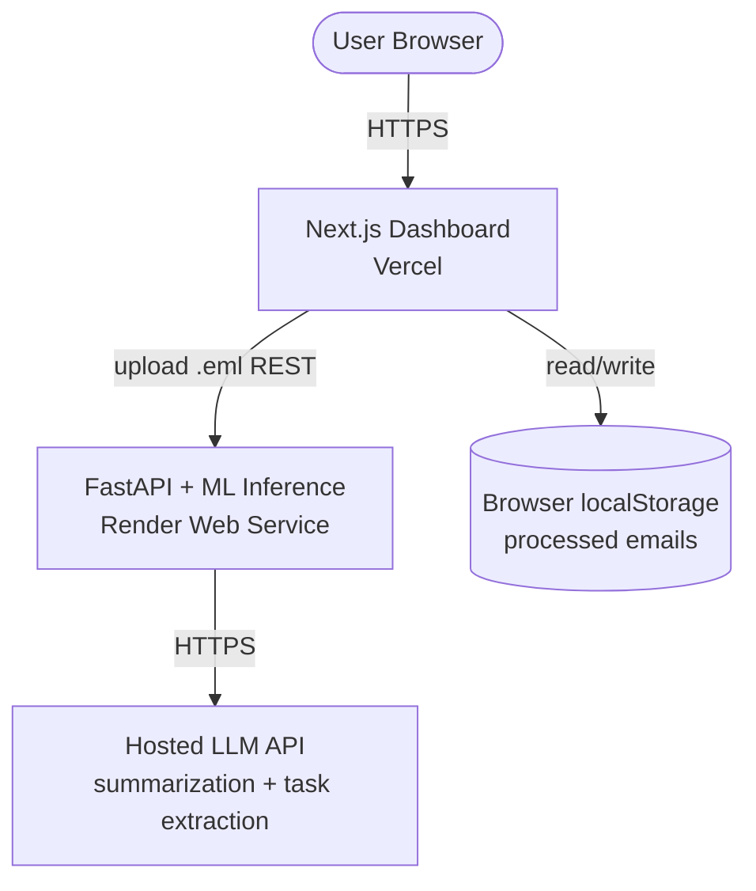

# ARCHITECTURE.md

> System architecture for PriorMail. This file is the canonical reference for how components fit together. If a sibling repo's behavior conflicts with what's described here, this file is correct and the repo needs to change.

---

## 1. System Overview

PriorMail is a 2-tier stateless web app: Next.js client → FastAPI server, with DistilBERT models running in-process on the FastAPI side. There is no database — the user uploads `.eml` files, the backend analyzes them, and results are persisted in the **browser's `localStorage`**.



---

## 2. Components

### Next.js Dashboard (Vercel)
- **Repo:** `prior-mail-frontend`
- **Responsibility:** User-facing dashboard, `.eml` file upload, viewing classified emails and tasks
- **Runtime:** Edge + Node (Next.js App Router on Vercel)
- **Outbound:** REST calls to FastAPI backend
- **Storage:** Browser `localStorage` — all processed email results are kept here; no server-side persistence

### FastAPI API (Render Web Service)
- **Repo:** `prior-mail-backend`
- **Responsibility:** REST API, `.eml` parsing, in-process ML inference, LangGraph orchestration
- **Runtime:** Python 3.11, Uvicorn, single instance (MVP)
- **Outbound:** hosted LLM API (for summarization + task extraction)
- **Models loaded at startup:** priority classifier, phishing detector
- **Stateless:** no database; every request is self-contained

### Hosted LLM API (TBD)
- **Decision pending:** Anthropic vs OpenAI (see Open Decisions)
- **Used for:** summarization + task extraction (NOT for priority classification or phishing detection — those use our DistilBERT models)

---

## 3. Data Flow Scenarios

### 3.1 User Uploads an Email

```
User → Vercel: picks or drops a .eml file onto the upload UI
Vercel → FastAPI: POST /api/v1/emails/analyze  (multipart/form-data, file=<.eml bytes>)
FastAPI → [parse_eml node]: extract subject, sender, received_at, body from .eml
FastAPI → [LangGraph pipeline]: see §3.2
FastAPI → Vercel: JSON response with full classification result
Vercel → localStorage: append result to "priormail_emails" key
Vercel → User: render updated inbox
```

### 3.2 Email Processing Pipeline (LangGraph)

```
START
  ↓
[parse_eml]            parse raw .eml bytes → subject, sender_email, sender_name,
                       received_at, body_text, snippet (first 200 chars)
  ↓
[preprocess]           strip HTML, collapse whitespace, replace URLs/emails with tokens
  ↓
[detect_phishing]      DistilBERT phishing model
  │
  ├── is_phishing=true ──→ [return_early]   skip priority/summary/tasks;
  │                                          return result with priority=null, summary=null, tasks=[]
  │
  └── is_phishing=false ─→ [classify_priority]   DistilBERT 4-class model
                              ↓
                            [summarize]           LLM call: 2–3 sentence summary
                              ↓
                            [extract_tasks]       LLM call: JSON array of {description, due_date}
                              ↓
                            [return]              full result
  ↓
END
```

State schema lives in `prior-mail-backend/src/priormail/agents/state.py` (Pydantic model). Each node is a pure function `(State) -> Partial[State]`. There are no side effects — no DB writes anywhere in the pipeline.

### 3.3 User Views Inbox

```
User → Vercel: open / (dashboard)
Vercel: read "priormail_emails" from localStorage
Vercel → User: render email list sorted by processed_at DESC (client-side)
```

All filtering, sorting, and search happen client-side over the localStorage data.

### 3.4 User Clears Data

```
User → Vercel: settings → "Clear all emails"
Vercel: localStorage.removeItem("priormail_emails")
Vercel → User: empty inbox
```

No server call needed — data lives only in the browser.

---

## 4. Deployment Topology

```
┌─────────────────────────────────────────────────────────────┐
│                         Internet                            │
└──────────────┬──────────────────────────┬───────────────────┘
               │                          │
       ┌───────▼───────┐         ┌───────▼────────┐
       │  Vercel CDN   │         │ Render LB      │
       │ (Next.js)     │         │ (FastAPI)      │
       └───────────────┘         └────────────────┘
```

No shared database. No background workers. No Supabase.

### Environments

| Env | Frontend | Backend | Notes |
|---|---|---|---|
| `dev` (local) | localhost:3000 | localhost:8000 | each dev has own `.env` |
| `prod` | priormail.app (TBD domain) | api.priormail.app | demo + final showcase |

> For the capstone we run a single environment. No staging needed.

### Secrets Management

- **Vercel:** project env vars (LLM API key for any server-side calls, backend URL)
- **Render:** project env vars (LLM API key, model URIs)
- **Local dev:** `.env.local` (gitignored), shared template in `.env.example`

No user-level secrets to manage — there is no OAuth, no refresh tokens, no Vault.

---

## 5. Cross-Repo Dependencies

```
prior-mail-docs (specs)
        ▲
        │ submodule
        │
   ┌────┴─────┬─────────────┐
   │          │             │
backend   frontend       model
   │          │             │
   │          └─consumes────┘ (API contract)
   │
   └─consumes─checkpoints (via Supabase Storage URI in env)
```

### Hard Dependencies

- `prior-mail-backend` ← needs trained checkpoints from `prior-mail-model` (consumed via Supabase Storage URI in env — Storage only, not the full Supabase stack)
- `prior-mail-frontend` ← needs FastAPI endpoints from `prior-mail-backend` (HTTP)
- Both ← consume `prior-mail-docs` as submodule

### Soft Dependencies

- Frontend and backend must agree on the `AnalysisResult` response shape. The contract in `API_CONTRACT.md` and `DATA_MODELS.md` is authoritative.

---

## 6. localStorage Schema

The frontend stores all processed emails in `localStorage` under the key `"priormail_emails"` as a JSON array of `StoredEmail` objects. See `DATA_MODELS.md §4` for the TypeScript type.

Key decisions:
- **No server-side persistence.** If the user clears browser storage, their history is gone.
- **UUID is assigned client-side** at upload time, before the API call.
- **Max storage target:** keep under 5 MB total (typical `localStorage` limit). The backend returns `body_text` in the response; the frontend may choose to omit it from storage to save space.

---

## 7. Observability

Minimal for MVP:

- **Logs:** `structlog` JSON to stdout, ingested by Render's log viewer
- **Metrics:** request counts and latencies via FastAPI middleware → log line
- **Errors:** Sentry (free tier) for both frontend and backend
- **ML run tracking:** `wandb` in the model repo only

---

## 8. Open Decisions

LLMs and humans: do not assume an answer. These are tracked here and resolved via PR.

- [ ] Summarizer + task extractor: hosted LLM (Anthropic / OpenAI) or local (Llama / Mistral)?
- [ ] `.eml` file size limit: what is the max accepted? (Suggested: 5 MB)
- [ ] localStorage eviction: oldest-first when approaching the storage limit, or manual clear only?

---

*Last updated: 2026-06-17*
